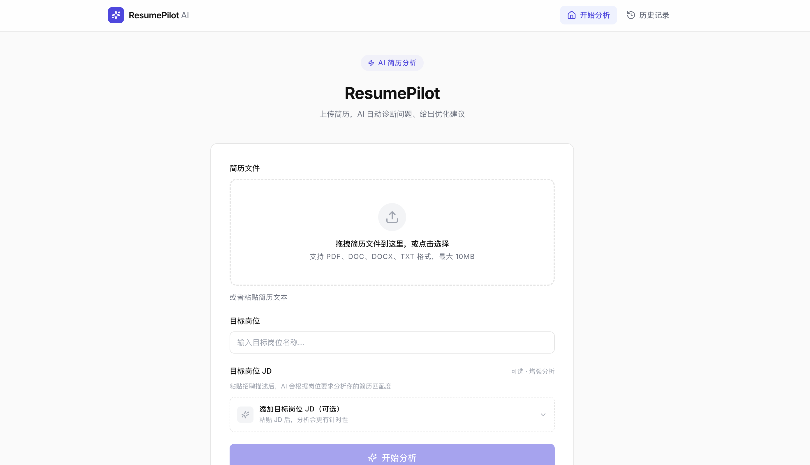
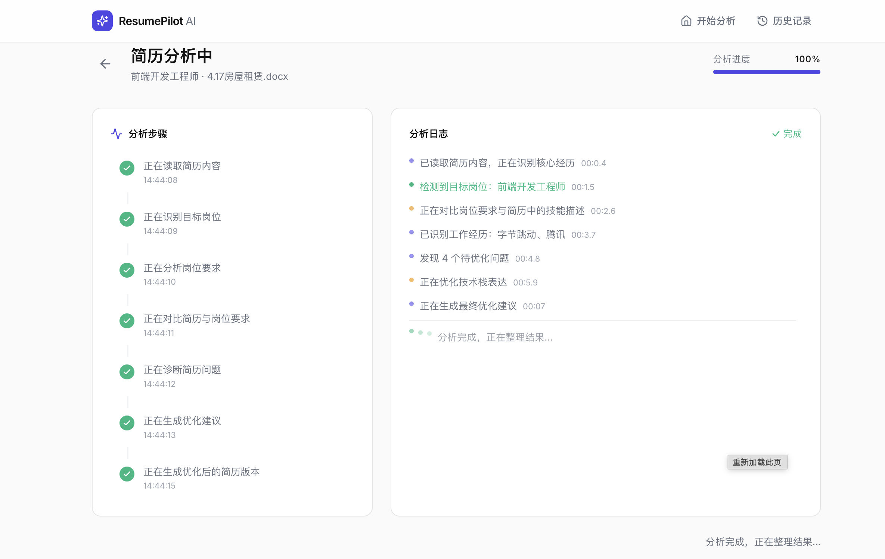
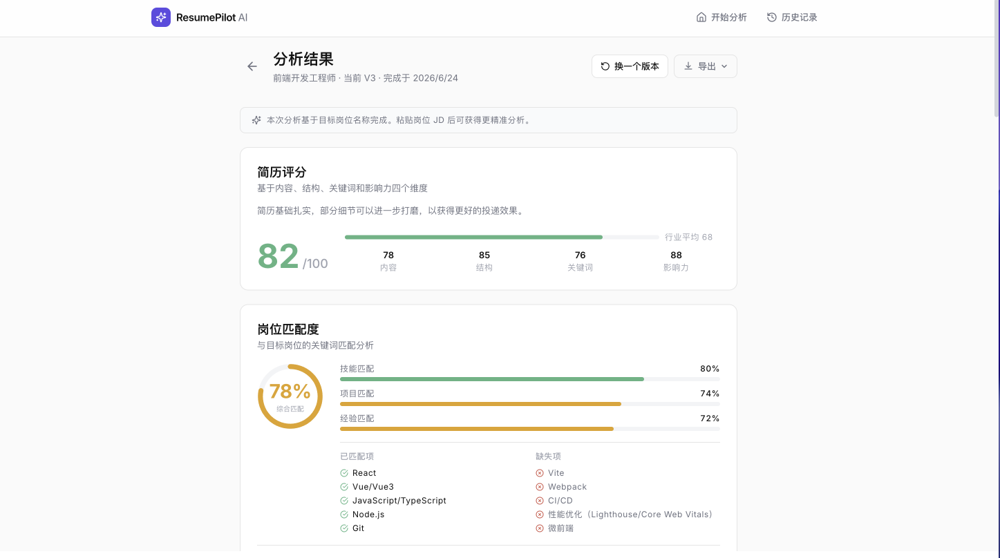
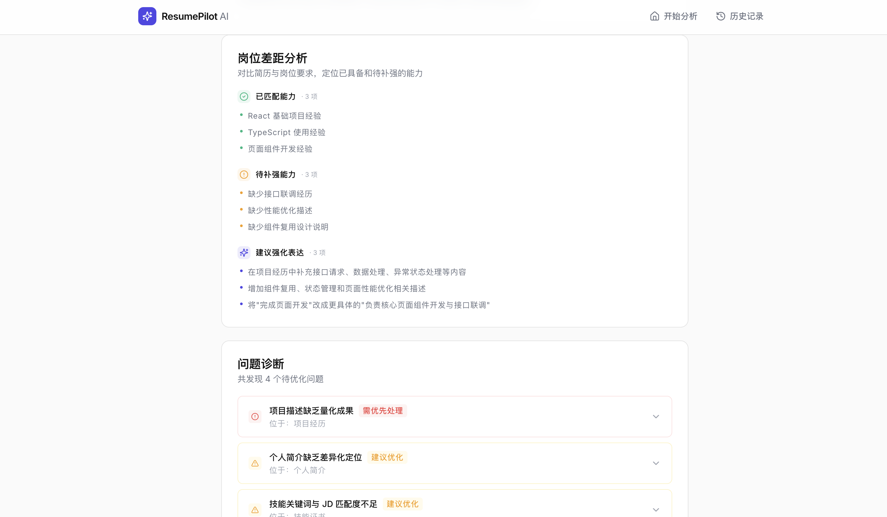
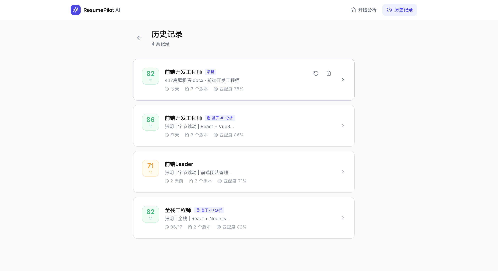

# ResumePilot AI

一个帮助求职者理解简历问题、并获得优化建议的 AI 简历助手。

---
事先说明: 
    产品说明

本版本使用模拟数据展示完整的 AI 简历分析体验流程，涵盖从上传、岗位 JD 分析、AI 分析过程展示到结果编辑和版本管理的全部交互节点。后续可接入真实的简历解析服务和语言模型 API。

开发者联系:✈️：@qiqi_dawang
---
## 为什么做这个项目

很多求职者反复修改简历，但并不知道真正的问题出在哪里。

有人把项目经历写得密密麻麻，招聘者扫一眼却抓不到重点；有人罗列了一堆技术栈，却没有一条和目标岗位真正匹配；还有人改了十几版简历，每一版看起来都不错，但面试邀约并没有变多。

AI 直接给出“修改后的简历”很容易，但要让人看懂“自己到底哪里写得不好”，并且愿意动手调整，是另一件事。

后来我又发现，简历优化不能只看简历本身。

同一份简历，投前端工程师和投产品经理，判断标准完全不同。

所以我在产品里加入了目标岗位 JD 分析：用户可以粘贴招聘描述，让 AI 根据真实岗位要求判断简历匹配度，而不是泛泛地给出优化建议。

这个项目想做的就是这件事：把 AI 分析的过程、结论、问题解释清楚，让用户既能看到结果，也能理解为什么。

---

## 这个项目解决什么问题

- 不知道简历里哪里写得不够好
- 不知道当前简历和目标岗位的差距在哪
- 不知道项目经历要怎么改才能更突出
- 不知道岗位 JD 里哪些要求应该体现在简历中
- AI 直接给结果，但缺少解释过程，看完仍然不知道怎么自己写

---

## 我怎么设计

整个产品的使用流程是：

```text
上传简历 → 确认岗位 → 粘贴岗位 JD → AI 分析 → 查看评分和问题 → 编辑结果 → 回退版本
每一步都尽量短，让用户始终知道自己在做什么、下一步可以做什么。

* 上传简历：支持文件拖拽，也支持直接粘贴文本
* 确认岗位：可以从简历里自动识别，也可以手动选择
* 粘贴岗位 JD：让分析结果更贴近真实招聘要求，不再只是泛泛优化
* AI 分析：把分析过程逐步展示给用户，而不是只给一个最终结果
* 查看评分和问题：把分数、岗位匹配度、岗位差距、问题诊断、优化建议按顺序呈现
* 编辑结果：用户可以直接在 AI 生成的版本上修改
* 回退版本：所有版本都可以切换回任意一个历史版本

⸻

核心功能

* 简历评分：从内容、结构、关键词、影响力四个维度评估
* 岗位匹配度：识别当前简历和目标岗位在技能上的匹配与缺失
* 岗位 JD 分析：提取招聘描述里的核心要求，并和简历内容进行对比
* 岗位差距分析：展示已匹配能力、待补强能力和建议强化表达
* 分析过程展示：把 AI 分析的步骤和思考过程逐步展示给用户
* 问题诊断：识别简历中具体可以改进的位置，并解释为什么
* 优化建议：根据诊断结果和岗位 JD 生成可执行的修改方向
* 结果编辑：用户可以直接在 AI 生成版本上手动修改
* 版本回退：每次重新生成都会保留旧版本，可以随时切换回去
* 失败处理：覆盖上传失败、解析失败、分析超时等异常情况

⸻

设计思考

为什么评分放在最上面？

用户最关心的第一个问题就是“我的简历现在到底怎么样”。评分是最直观的反馈入口。

为什么需要岗位 JD 分析？

只看简历本身，很难判断它是否适合某个具体岗位。加入岗位 JD 后，AI 可以根据真实招聘要求判断用户哪里匹配、哪里缺失，让优化建议更有依据。

为什么要做岗位差距分析？

很多用户不是完全没有能力，而是不知道哪些能力需要被表达出来。岗位差距分析可以把“岗位需要什么”和“简历体现了什么”放在一起看，让用户更清楚应该补强哪些内容。

为什么需要展示 AI 分析过程？

AI 直接给结果会让人不放心。让用户看到分析是怎么一步步进行的，可以建立对结果的信任。

为什么要支持版本回退？

AI 优化不是一步到位的事情。用户经常需要对比多个版本才能决定哪个更好，版本回退是这个流程里不可缺少的一环。

为什么要认真处理失败状态？

AI 产品经常出现各种边界情况。如果错误处理做得粗糙，用户会立刻失去信任。每一个失败状态都应该清楚地告诉用户：发生了什么、为什么会这样、下一步可以做什么。

为什么整体视觉走克制路线？

求职本身是一个严肃场景。求职者打开工具时其实带着一点焦虑，太花哨的视觉会让人分心。设计目标是让用户专注于内容，而不是界面本身。

⸻

技术实现

* 框架：React + TypeScript
* 样式：Tailwind CSS
* 状态管理：Zustand
* 构建工具：Vite

⸻

本地运行项目
<!--
 # 安装依赖
    npm install

# 启动开发服务
    npm run dev

# 打包生产版本
    npm run build
 -->
 启动后访问 http://localhost:5173。


 产品说明

本版本使用模拟数据展示完整的 AI 简历分析体验流程，涵盖从上传、岗位 JD 分析、AI 分析过程展示到结果编辑和版本管理的全部交互节点。后续可接入真实的简历解析服务和语言模型 API。

⸻


## 产品截图

### 首页



### AI 分析过程



### 分析结果



### 岗位差距分析



### 历史版本

